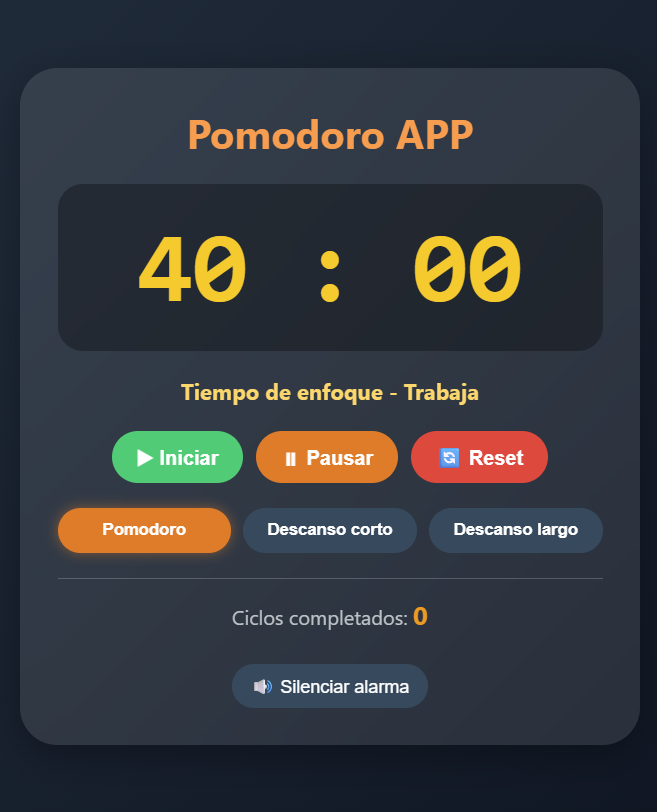

# 🍅 Pomodoro Timer App



Aplicación de escritorio para la técnica Pomodoro con alarma integrada. Mejora tu productividad trabajando en intervalos de 25 minutos con descansos activos.

## ✨ Características

- ⏱️ **Timer Pomodoro** (25 minutos de enfoque)
- ☕ **Descanso corto** (5 minutos)
- 🌿 **Descanso largo** (15 minutos)
- 🔔 **Alarma personalizada** (alarma.mp3)
- 🔇 **Control de silencio** - Silencia la alarma cuando termina el tiempo
- 📊 **Contador de ciclos** - Lleva registro de tus pomodoros completados
- 🔄 **Cambio automático** entre ciclos al silenciar la alarma
- 💬 **Notificaciones** del sistema

## 🖼️ Captura de pantalla


## 🚀 Instalación

### Método 1: Instalador (recomendado)
1. Descarga el archivo `pomodoro-app-1.0.0 Setup.exe`
2. Ejecútalo y sigue los pasos del instalador
3. La app se instalará en `%localappdata%\pomodoro-app\`
4. Aparecerá un acceso directo en el menú de inicio

### Método 2: Versión portátil
1. Extrae la carpeta `Pomodoro Timer-win32-x64`
2. Ejecuta `Pomodoro Timer.exe` directamente
3. No requiere instalación

## 📦 Requisitos del sistema

- **SO**: Windows 7 o superior (64 bits)
- **RAM**: 256 MB mínimo
- **Espacio**: 150 MB

## 🎮 Cómo usar

1. **Iniciar**: Presiona el botón ▶ para comenzar el temporizador
2. **Pausar**: ⏸ para detener temporalmente
3. **Reset**: 🔄 para reiniciar el tiempo actual
4. **Cambiar modo**: Selecciona entre Pomodoro, Descanso corto o Descanso largo
5. **Silenciar alarma**: Cuando termine el tiempo, presiona "Silenciar alarma" para detener el sonido y continuar

## 🔊 Configuración de alarma

- La alarma suena en **loop** cuando se completa cualquier tiempo
- Para detenerla, presiona el botón **"Silenciar alarma"**
- El botón **"🔊 Silenciar alarma"** alterna entre silencio activado/desactivado para futuras alarmas

## 🛠️ Desarrollo

### Tecnologías usadas
- Electron
- HTML5/CSS3
- JavaScript (Vanilla)

### Comandos útiles

```bash
# Iniciar en modo desarrollo
npm start

# Generar instalador
npm run make

# Generar .exe portátil
npx electron-packager . "Pomodoro Timer" --platform=win32 --arch=x64 --out=dist